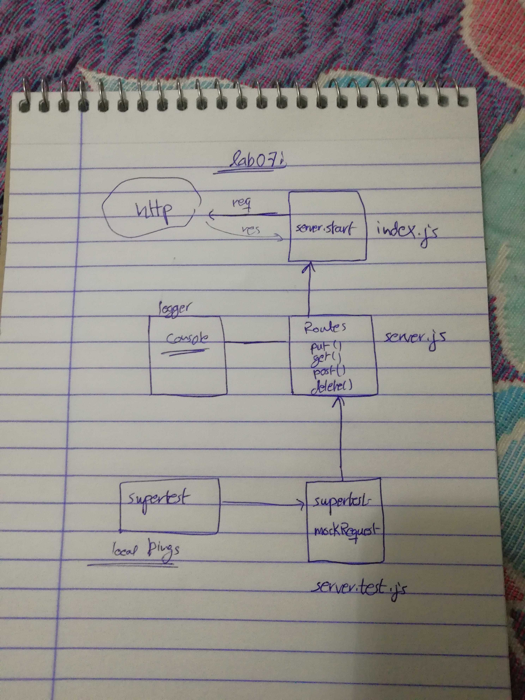

# LAB - Class 07

## Api-server

### Author: Ahmad K. Al-Mahasneh

### Links and Resources

- [submission PR](http://xyz.com)
- [ci/cd](http://xyz.com) (GitHub Actions)
- [back-end server url](http://xyz.com) (when applicable) no link yet

### Setup

#### `.env` requirements (where applicable)
- `PORT` - 3000

#### How to initialize/run your application (where applicable)

- `npm run start`

#### Tests

- How do you run tests?
  npm run test
- Any tests of note?
  supertest

#### UML

